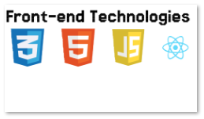

## Projeto de exercicio level 2



# ✒️ Autor 
#### Thiago Masseno Maciel
#### graduando em Sistemas de informação na faculdade [uni7](https://www.uni7.edu.br/)
#### portifólio [link aqui](https://thiagomassenomaciel.github.io/MYportifolio.github.io/)

# 🛠️ Construído com as tecnologias
#### html5
#### css3
#### React

# 📌Aprendizados 
#### O que considero aprendizado mais importante é a maneira como eu devo organizar as tags html evitando ter muitas `<div>` e implementando os conceitos de seo para um site, o quão é importante diferenciar pedaços do layout da página web com as tags semânticas:
###### `erro 1` -  Functions are not valid as a React child. This may happen if you return App instead of <App /> from render. Or maybe you meant to call this function rather than return it. root.render(App) . Isso quer dizer que se eu for usar componente funcional preciso chamar este componente com o padrão em tag <Componente />
###### por este motivo da obrigatoriedade de chamar o componente adicionei isto
```
const main = (
  <App/>
)
const root = ReactDOM.createRoot(document.getElementById('root'));
root.render(main);
```
# Getting Started with Create React App

This project was bootstrapped with [Create React App](https://github.com/facebook/create-react-app).

## Available Scripts

In the project directory, you can run:

### `npm start`

Runs the app in the development mode.\
Open [http://localhost:3000](http://localhost:3000) to view it in your browser.
