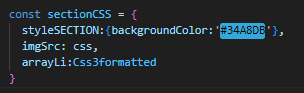

## Projeto exercise lewvel 0 

# ✒️ Autor 
#### Thiago Masseno Maciel
#### graduando em Sistemas de informação na faculdade [uni7](https://www.uni7.edu.br/)
#### portifólio [link aqui](https://thiagomassenomaciel.github.io/MYportifolio.github.io/)

# 🛠️ Construído com as tecnologias
#### html5
#### css3
#### React  + Vite

# 📌Aprendizados 
#### Fiz uma diminuição de código repetitivo reutilizando o componente criado .
#### Percebi que é muito melhor passar o props como objeto, por objetos na array , e somente com uma linha pelo map executar todas as vezes que o componente vai repetir mudando so o objeto props.

```
const sectionData = [
    {
      styleSECTION: { backgroundColor: '#34A8DB' },
      imgSrc: css,
      arrayLi: Css3formatted,
    },
    {
      styleSECTION: { backgroundColor: '#FFDA3E' },
      imgSrc: js,
      arrayLi: JavaScriptFORMATTED,
    },
    {
      styleSECTION: { backgroundColor: '#62DAFB' },
      imgSrc: react,
      arrayLi: ReacttFORMATTED,
    },
  ];

```
###### Em vez de eu escrever para chamar 3 vezes o mesmo componente passando para cada um o objeto props diferente, uso o map e só escrevo a chamada do componente uma vez

```
{sectionData.map((dataObj, index) => ( <Sectionn key={index} data={dataObj} />     ))}
```

## `erro 1` -  Eu não tinha validade as props de cada um dos componentes. Installa a bilioteca PropTypes, fez import e usa na variavel que tem o componente reutilizável.

##### quanto estiver declarando os dados dentro de um objeto que vai ser passado como props do componente pai para o componente filho deve ser assim: na situação que tem variavel como dado deste objeto


##### it means this : from parrent component i must to pass object with the same name of variable must be named "data" too ?
``` 
Yes, that's correct.
The error message you're seeing indicates that the Sectionn component expects to receive a prop named data.
```
##### Intalar biblioteca PropTypes, importar no app.jsx e referenciar quando for escrever os parâmetros do componentes
# React + Vite

```
npm install prop-types
```

```
import PropTypes from 'prop-types';
```

```
const Sectionn = ({
  data: { styleSECTION, imgSrc, arrayLi },
}) => {
  // ... rest of the component code

  Sectionn.propTypes = {
    data: PropTypes.shape({
      styleSECTION: PropTypes.object.isRequired,
      imgSrc: PropTypes.string.isRequired,
      arrayLi: PropTypes.arrayOf(PropTypes.node).isRequired,
    }).isRequired,
  };
};

```

###### This template provides a minimal setup to get React working in Vite with HMR and some ESLint rules.

###### Currently, two official plugins are available:

- [@vitejs/plugin-react](https://github.com/vitejs/vite-plugin-react/blob/main/packages/plugin-react/README.md) uses [Babel](https://babeljs.io/) for Fast Refresh
- [@vitejs/plugin-react-swc](https://github.com/vitejs/vite-plugin-react-swc) uses [SWC](https://swc.rs/) for Fast Refresh
