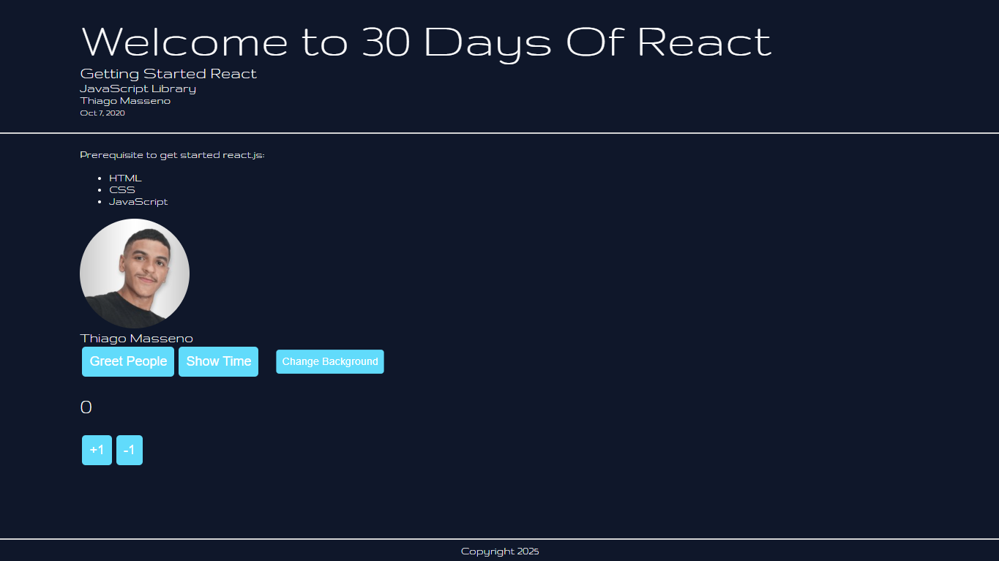
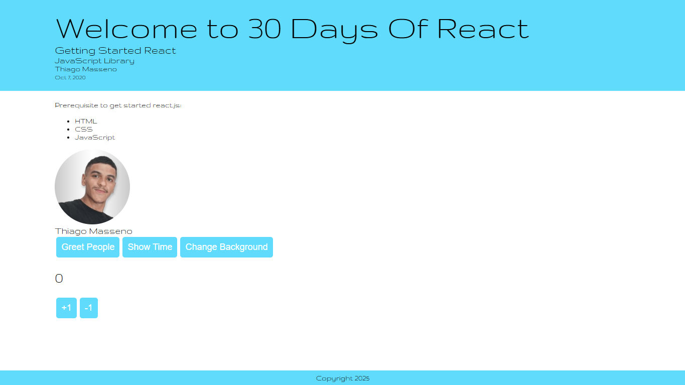
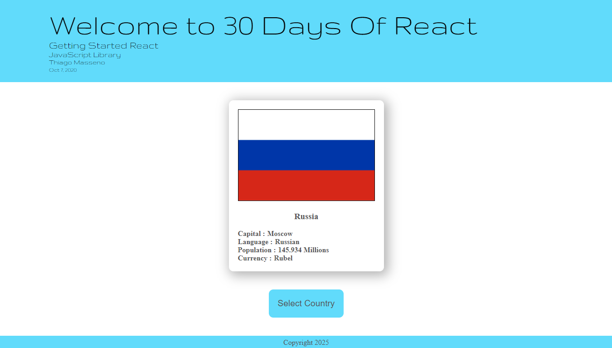

# Exercises from day 08 [link]()
## Day 8: States

#### Exercises: Level 1
###### What was your state today? Are you happy? I hope so. If you manage to make it this far you should be happy.
###### What is state in React ?
###### What is the difference between props and state in React ?
###### How do you access state in a React component ?
###### How do you set a set in a React component ?

#### Exercise: Level 2
###### clicked

###### unclicked

#### Exercise: Level 3 
