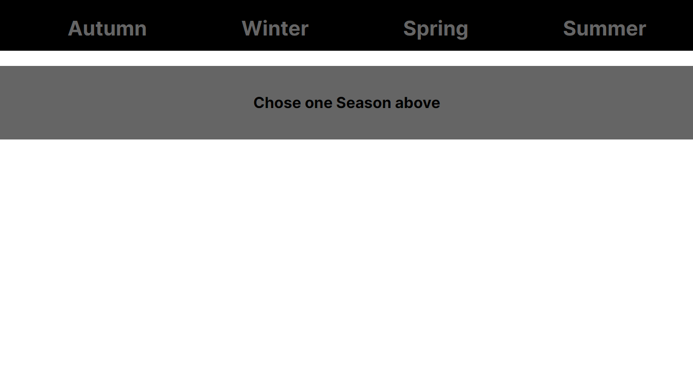
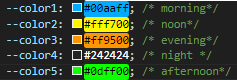
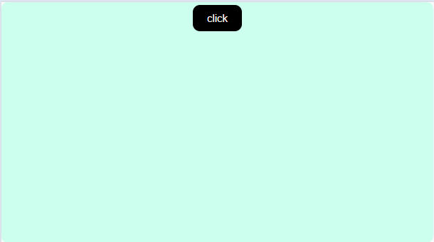
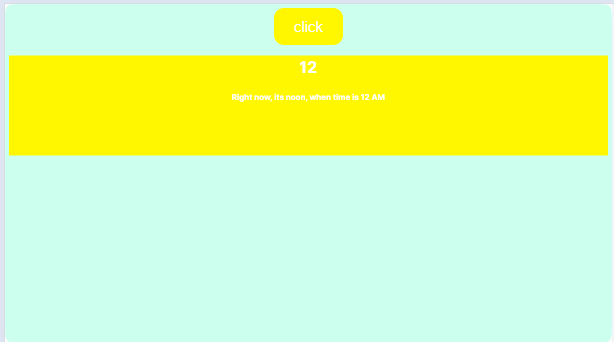
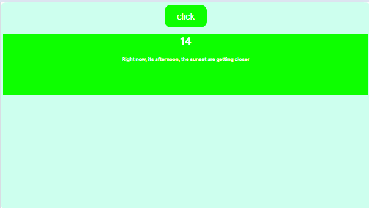
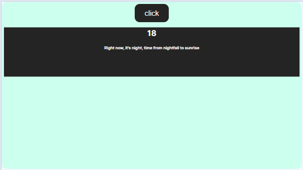
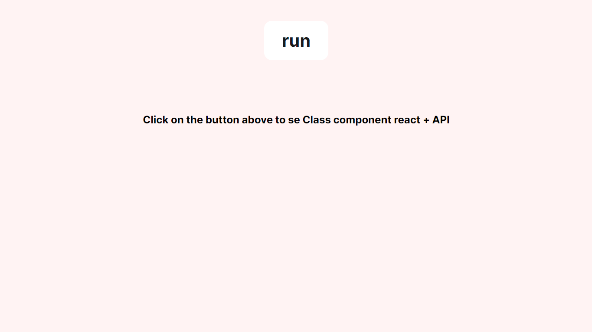
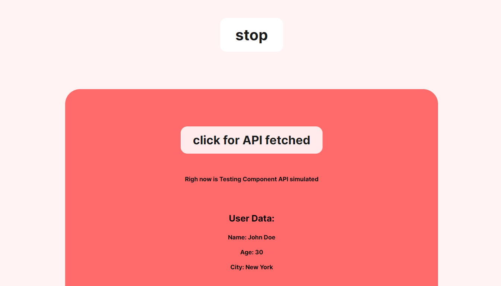
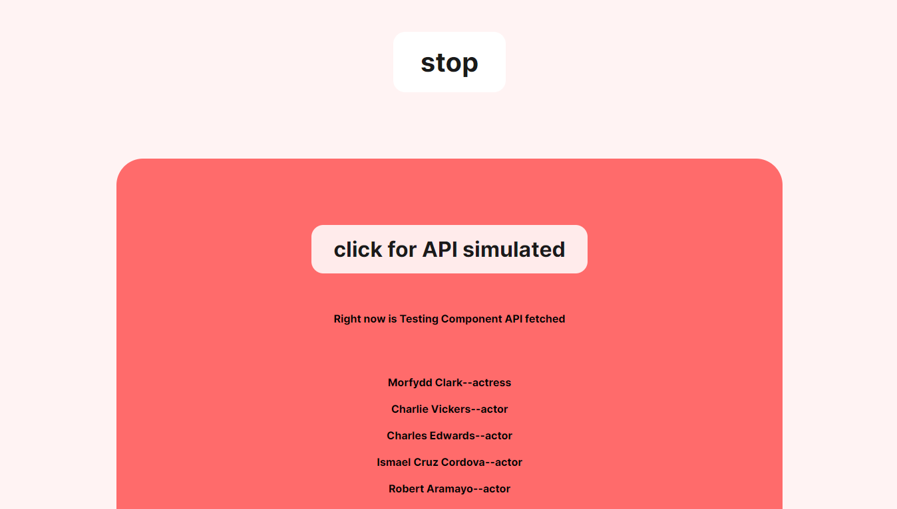

# Exercises from day 9 [link]()
## Day 9: Conditional Rendering

#### Exercises: Level 1
###### What is conditional rendering?
###### How do you implement conditional rendering?
###### Which method of conditional rendering do you prefer to use?

#### Exercises: Level 2 (i need 2h30' to make it)
###### Make a single page application which changes the body of the background based on the season of the year(Autumn, Winter, Spring, Summer)

#### Exercises: Level 3 (i need 3h20' to make it)
###### Make a single page application which change the body of the background based on the time of the day(Morning, Noon, Evening, Night)

###### Before you click on the button

###### After you click on the button when its 0 times o'clock

###### After you click on the button when its 3 times o'clock

###### After you click on the button when its 7 times o'clock

###### After you click on the button when its 12 times o'clock

###### After you click on the button when its 14 times o'clock

###### After you click on the button when its 17 times o'clock

###### After you click on the button when its 18 times o'clock

#### Exercises: Level 4 (i need 5h36' to make it)
###### Fetching data takes some amount of time. A user has to wait until the data get loaded. Implement a loading functionality of a data is not fetched yet. You can simulate the delay using setTimeout.
###### see more etails [here](./exercise-level-4/README.md)
###### ` DataFetcherNOapi ` - simulated API using SetTimeOut()
###### ` DataFetcherAPI `   - fetching API using `async` and `await`
###### Before click button `run`

###### After clicked button `run`

###### After clicked button `click for API fetched`
