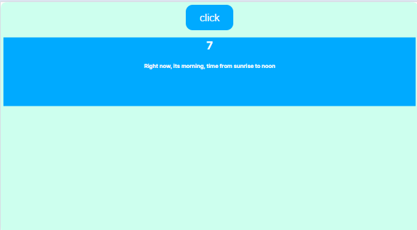
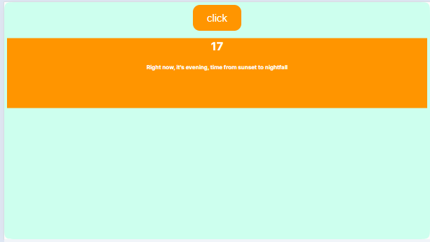
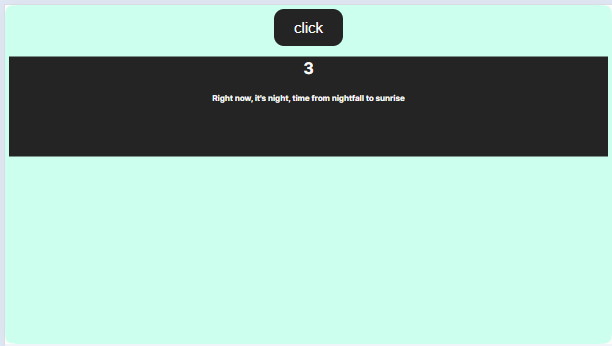
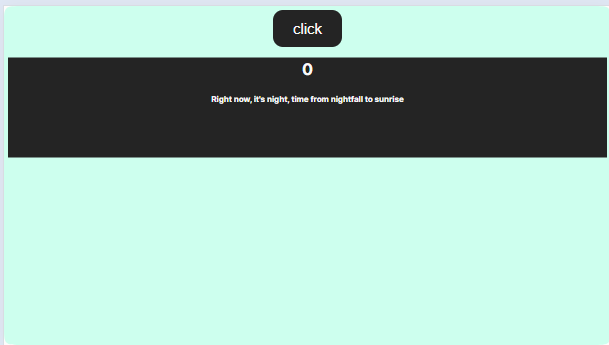

# Morning : `time from sunrise to noon`
# Noon : `when time is 12 AM`
# Evening : `time from sunset to nightfall`
# Nigh : ` time from nightfall to sunrise`

# Dependendo da hora do dia vai aparecer uma coisa diferente dentro da div `app` depois de clicar no botão click

## Se o site for executado de : 
## --> manhã

## --> meio-dia

## --> tarde 

## --> anoitecendo

## --> noite 

# React + Vite

This template provides a minimal setup to get React working in Vite with HMR and some ESLint rules.

Currently, two official plugins are available:

- [@vitejs/plugin-react](https://github.com/vitejs/vite-plugin-react/blob/main/packages/plugin-react/README.md) uses [Babel](https://babeljs.io/) for Fast Refresh
- [@vitejs/plugin-react-swc](https://github.com/vitejs/vite-plugin-react-swc) uses [SWC](https://swc.rs/) for Fast Refresh
