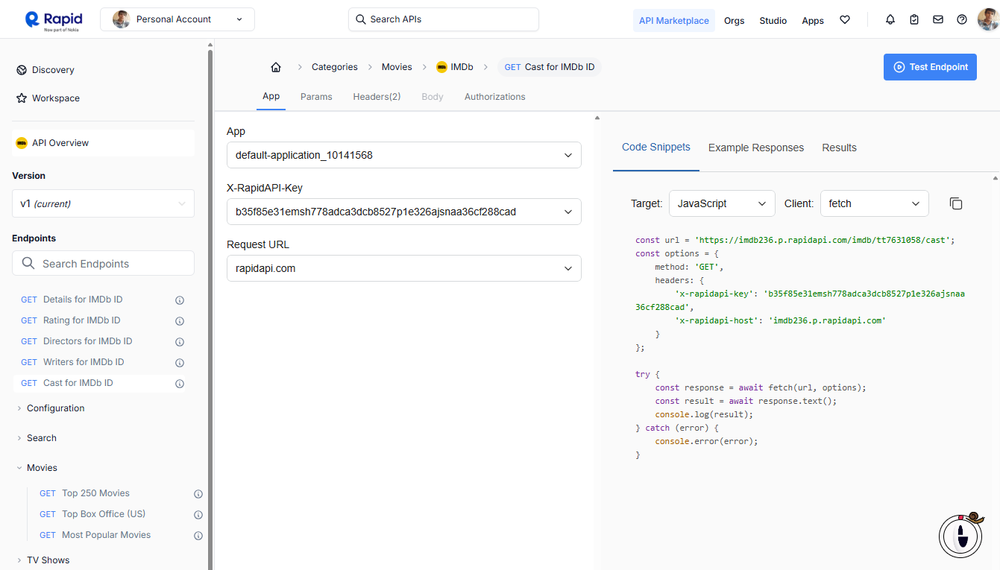

# Aprendi a usar api no fetch javascript 


#### API IMDb [link to rapid api ](https://rapidapi.com/octopusteam-octopusteam-default/api/imdb236/playground/apiendpoint_88dd8377-8194-4542-84c7-10cadb07a01e)

#### Assisti o video [link tutorial](https://youtu.be/ytNyibPQFhw?si=j6nBrLM8f9eMJGnl)

###### 1 --> Escolher api do site [rapidapi.com](https://rapidapi.com/hub)
###### 2 --> Escolher qual vai ser o EndPoint
###### 3 --> Agora vai fazer um test 
###### 4 --> Pegar o código no code snnipets selecionado `Javascript` e `fetch`
 

```
const url = 'https://imdb236.p.rapidapi.com/imdb/tt7631058/cast';
const options = {
	method: 'GET',
	headers: {
		'x-rapidapi-key': 'b35f85e31emsh778adca3dcb8527p1e326ajsnaa36cf288cad',
		'x-rapidapi-host': 'imdb236.p.rapidapi.com'
	}
};

try {
	const response = await fetch(url, options);
	const result = await response.text();
	console.log(result);
} catch (error) {
	console.error(error);
}
```
###### 5 --> Adaptar para o que você precisa

# React + Vite

This template provides a minimal setup to get React working in Vite with HMR and some ESLint rules.

Currently, two official plugins are available:

- [@vitejs/plugin-react](https://github.com/vitejs/vite-plugin-react/blob/main/packages/plugin-react/README.md) uses [Babel](https://babeljs.io/) for Fast Refresh
- [@vitejs/plugin-react-swc](https://github.com/vitejs/vite-plugin-react-swc) uses [SWC](https://swc.rs/) for Fast Refresh
